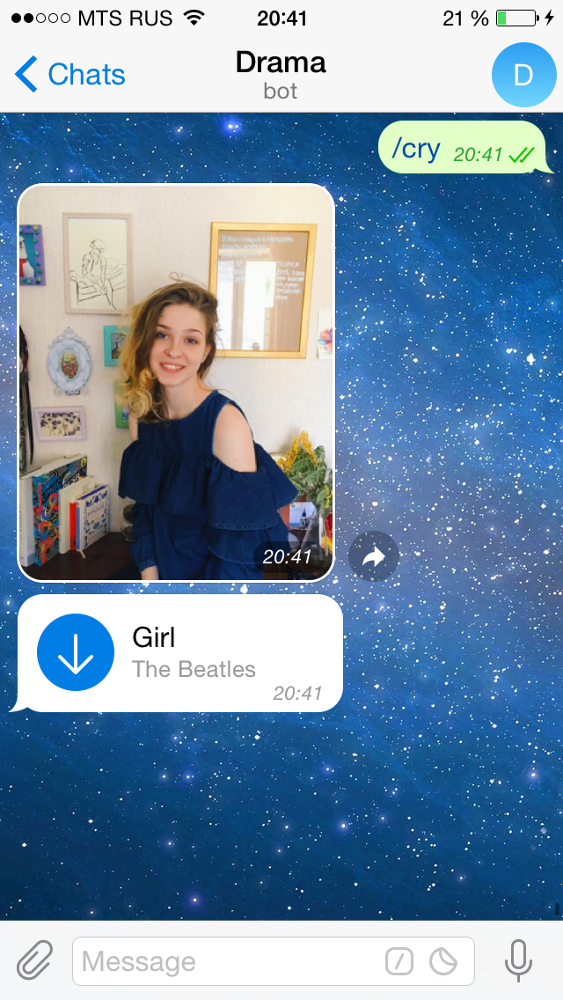

# drama 

Bot for guys falled in love

### commands

`/cry`  send instagram photo of your favourite girl with sad song (from `music` folder)

`/advice`  send helpful advice (in russian)

### scripts

`loader.py`  load and select valid instagram photos (with a single face; see `config.json`)

`bot.py`  run telegram bot (also exists in other bots)

# popsa 

Extension for *ilovemusic* project

### commands

`relative_path`  path to *ilovemusic*

`playlists_path`  path to m3u playlists

`/<tag>`  send song for <tag> playlist 

`/<tag1>` and `/<tag2>`:  send song which present both `<tag1>` and `<tag2>` playlists

`/<tag1>` not `/<tag2>`:  send song which present in `<tag1>`, but don’t present in `<tag2>` playlist

# positive

Bot which sends only positive news

### commands

`/n`  send article link

### scripts

`news_crawl.py`  refreshes local newsbase

`sentiment.py`  calculates value of positiveness for every article in news base

### default sources

BBC  
CNN  
New York Times  
Reuters

# upd (21.04.18)

Fuck roskomnadzor!
